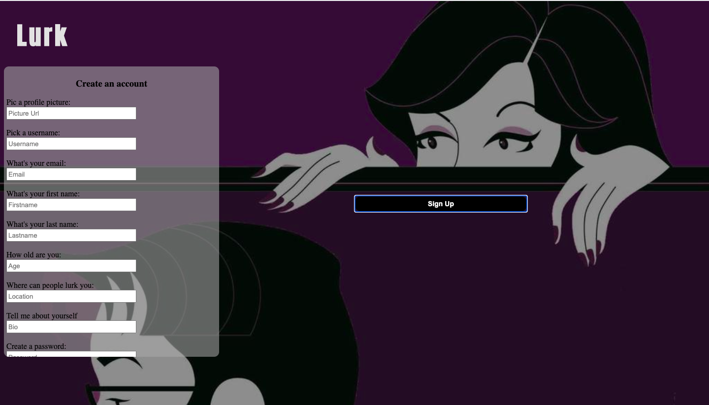
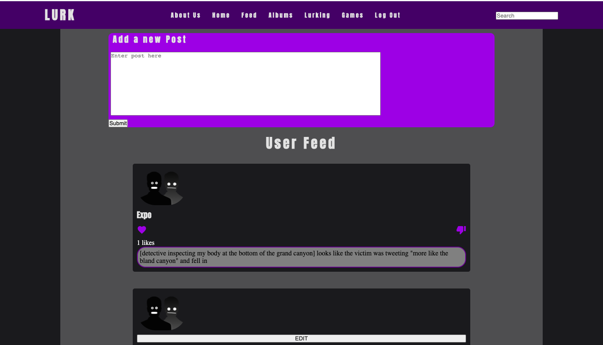
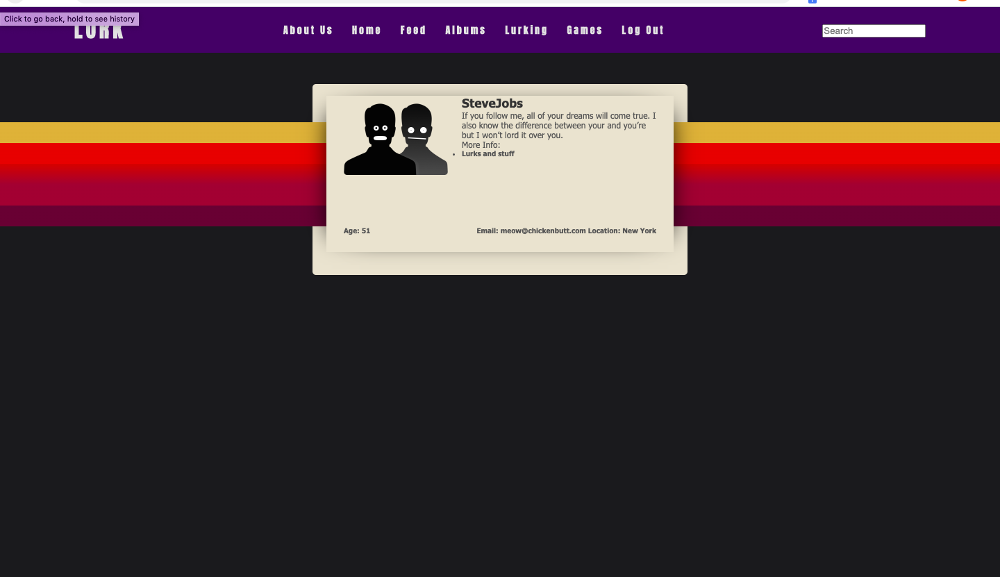

# Lurk

A social media app created using HTML, Javascript, and CSS. Users can create an account, 'lurk' (follow) other users, create posts, view all users posts, and create photo albums and upload photos.

Built with Javascript, HTML, CSS, Node.js with Express, and PostgreSQL.

## Features

Users are able to:

* Sign up for an account.
* Create posts. 
* Like/dislike/comment on other users posts. 
* Follow "lurk" or unfollow "unlurk" other users.

## Technologies Used

* HTML5. For the front-end/client interface of our app.
* CSS3. For the styling of our app.
* Node.js & Express.js. For the HTTP backend server.
* PostgreSQL. As our relation database management system.

## Technical milestones 
* Displaying all posts from all users in chronological order
* Including the number of likes in each post as well as the user
* Displaying all comments from each post
* Searching for a user

##  Local Setup

You must have installed Node.js, PostgreSQL and Nodemon in your computer.

You can check for these dependencies with node -v and psql -v. If your shell/terminal doesn't complain and you see version numbers you are good to go.

1. Clone this repo: 
  
   git clone https://github.com/tbriany/Lurk.git

2. Install dependencies for the Node/Express Server (backend folder):

   cd server && npm install

3. Install dependencies in the frontend folder:

   cd client && npm install

4. Create database and seed sample data while being in the server directory with:
 
   psql -f ./server/seed.sql
   Make sure PostgreSQL is running!

5. To launch the Node/Express server, inside the backend folder run:
 
   nodemon server.js
 
6. To launch the HTML, inside the frontend folder, and preferably in another terminal window run:
 
   open the HTML file in a browser 
 
